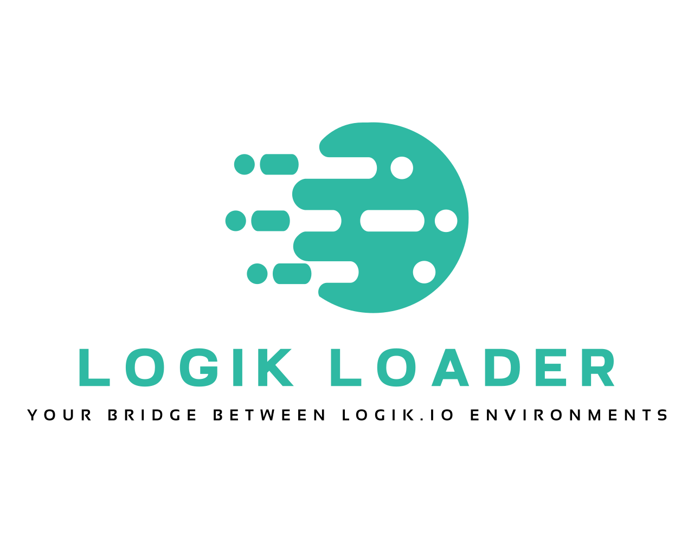

# Logik Loader

### Your Bridge Between Logik.io Environments


[](https://chromewebstore.google.com/detail/logik-loader/ghdjajiecpcobhfajgppapdlhdpbpfgf)

**Logik Loader** is the definitive utility for transferring configurations across Logik.io environments. It adds a productivity layout on top of the standard Logik.io Configuration UI to streamline testing, data migration, and payload management.

It allows you to effortlessly load complex JSON configurations, manage session states, and debug issues without the manual data entry overhead.

---

- [Key Features](#key-features)
- [Security and Privacy](#security-and-privacy)
- [Installation](#installation)
- [Usage Guide](#usage-guide)
  - [Starting a Session](#starting-a-session)
  - [Drafting & Downloading](#drafting--downloading)
  - [Session Reset](#session-reset)
- [Troubleshooting](#troubleshooting)
- [Development](#development)
  - [Project Structure](#project-structure)
  - [Architecture](#architecture)
- [Design Principles](#design-principles)
- [Contributing](#contributing)
- [About](#about)
- [License](#license)

---

## Key Features

- **Dynamic Payload Loading**: Instantly apply complex JSON configurations by pasting text or dragging and dropping a `.json` file directly into the panel.
- **Real-Time Validation**: Smart editor validates JSON structure and Product ID availability before allowing updates.
- **Session Management**: Automatically captures and tracks Session UUIDs. The "Active Session" mode locks inputs to prevent accidental changes during testing.
- **Soft Reset**: Start a new configuration context without reloading the page, while preserving the previous Session ID for reference.
- **Draft & Download**: Save your current session state as a draft or download the full configuration JSON for backup and migration.
- **Maintenance Mode**: Configurable kill-switch for enterprise governance.
- **Performance Optimized**: Uses debounced validation and asynchronous processing to handle massive JSON payloads without freezing the browser.

## Security and Privacy

The Logik Loader extension communicates directly between the user's web browser and the active Logik.io page. **No data is sent to third parties.**

- **Local Processing**: All JSON parsing, validation, and file generation happens client-side within the browser memory.
- **Authentication**: The extension leverages the existing session of the logged-in user. It does not require separate credentials and cannot access data you do not already have permission to see.
- **Storage**: Local storage is used solely to persist the "Debug Mode" preference. No business data or configuration payloads are ever stored permanently.
- **Scoped Access**: The extension only activates on `https://*.logik.io/*` domains.

## Installation

### Chrome Web Store (Recommended)

[](https://chromewebstore.google.com/detail/logik-loader/ghdjajiecpcobhfajgppapdlhdpbpfgf)

1.  Click the button above or [visit the store listing](https://chromewebstore.google.com/detail/logik-loader/ghdjajiecpcobhfajgppapdlhdpbpfgf).
2.  Click **Add to Chrome**.
3.  Pin the extension to your toolbar for easy access.

### Local Installation (Developer Mode)

_Use this method if you want to contribute to the code._

1.  Download or clone this repository.
2.  Open `chrome://extensions/` in your browser.
3.  Toggle **Developer mode** in the top right corner.
4.  Click **Load unpacked**.
5.  Select the root folder of this project (containing `manifest.json`).

## Usage Guide

### Starting a Session

1.  Navigate to any Logik.io configuration page (`.../testFrame.html`).
2.  Click the floating **Logik Loader** button.
3.  Toggle **Enable**.
4.  **Paste** your JSON payload or **Drag & Drop** a file.
5.  Click **Update**.

### Drafting & Downloading

Once a session is active, you can save your work at any time:

- **Draft**: Saves the current state to the Logik platform.
- **Download Session**: Generates a `.json` file of the full session configuration to your local computer.

### Session Reset

To start a new test without losing context:

1.  Click **Start New Configuration** in the side panel.
2.  Confirm the action.
3.  The UI will reset, but an overlay will display your **Previous Session ID** for reference.

## Troubleshooting

- **Extension Disabled**: If the toggle is off, the extension creates zero overhead and ignores all inputs.
- **White Screen**: If pasting a large file causes a brief freeze, wait a moment. The v3.0 engine uses asynchronous processing to recover quickly.
- **Debug Logs**: Toggle the "Debug" switch in the panel header to view detailed activity logs in the Console.

## Development

### Project Structure

```text
.
├── src/
│   ├── js/
│   │   ├── background/   # Service worker for script embedding
│   │   ├── content/      # Main UI and Logic controller
│   │   ├── handler/      # Internal Iframe logic
│   │   └── utils/        # Shared helpers (Logger, Debounce)
│   └── css/              # Centralized styling
├── manifest.json         # Extension configuration
└── README.md
```

### Architecture

Logik Loader uses a modular architecture to ensure stability and security:

1.  **Service Worker**: Identifies the target Logik configuration iframe.
2.  **Content Script**: Manages the overlay UI and user interactions.
3.  **Handler**: Embedded directly into the main world of the iframe to augment XHR requests safely.

## Design Principles

- **Non-Intrusive**: The tool stays completely inactive until explicitly enabled by the user.
- **Performance First**: Heavy operations (parsing, validation) are debounced to ensure the host application remains responsive.
- **Context Aware**: The UI adapts to the current state (Initializing, Active, Saved) to guide the user through the workflow.

## Contributing

Contributions are welcome! Please read our **[Contributing Guide](CONTRIBUTING.md)** for details on our code standards and the process for submitting pull requests.

## About

**Logik Loader** is developed and maintained by **[Pavan Kumar B](https://github.com/Pavan-Kumar-B)**.

If you find this tool useful, feel free to star the repository or contribute to the code.

**Contact & Support:** [logikloader@gmail.com](mailto:logikloader@gmail.com)

---

_Disclaimer: This extension is a community-driven developer tool and is not officially affiliated with, associated with, or endorsed by Logik.io._

## License

[MIT](./LICENSE)
